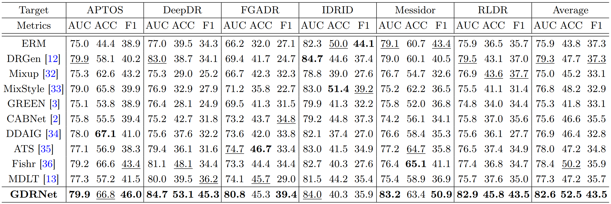
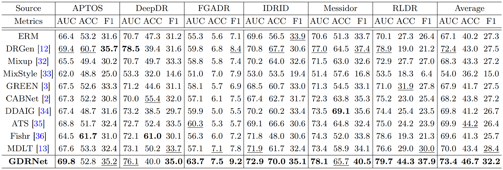
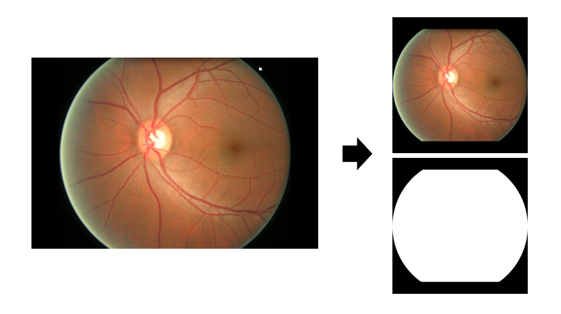
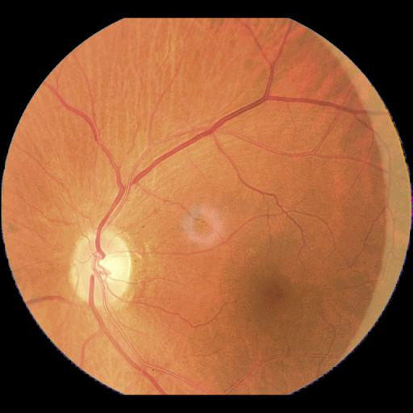
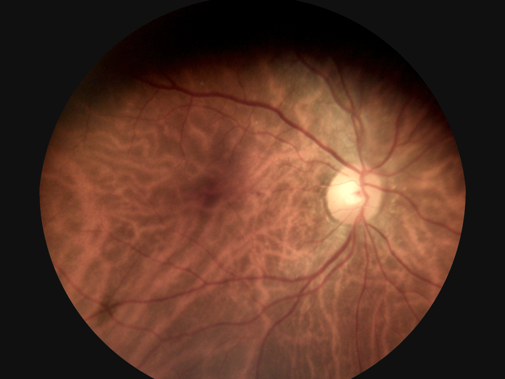

# Guideline for Building GDR-Bench Dataset

This README is an official guideline on how to prepare the datasets for our work, GDRBench. Our article "Towards Generalizable Diabetic Retinopathy Grading in Unseen Domains" has been accepted to MICCAI2023.

We include totally eight open-source fundus datasets, APTOS, DeepDR, FGADR, IDRiD, MESSIDOR, RLDR, DDR and Eyepacs, in GDRBench for diabetic retinopathy (DR) grading problem in domain generalization (DG) setting. We test our method and several state-of-the-art methods on pre-processed images. This guideline will show you how to get access to these datasets and how to pre-process them into available input datasets for GDRBench.

Besides, we provide open-source codes for pre-processing these datasets and several processed datasets which enjoy free redistribution license here.

<p align="center">
  
</p>

## Table of Contents

- [Guideline for Building GDR-Bench Dataset](#guideline-for-building-gdr-bench-dataset)
  - [Table of Contents](#table-of-contents)
  - [Current Results](#current-results)
  - [Get Access](#get-access)
      - [APTOS](#aptos)
      - [DeepDR](#deepdr)
      - [FGADR](#fgadr)
      - [IDRiD](#idrid)
      - [MESSIDOR](#messidor)
      - [RLDR](#rldr)
      - [DDR](#ddr)
      - [Eyepacs](#eyepacs)
  - [Process](#process)
  - [Problems May Occur](#problems-may-occur)
      - [APTOS](#aptos-1)
      - [DeepDR](#deepdr-1)
      - [FGADR](#fgadr-1)
      - [IDRiD](#idrid-1)
      - [MESSIDOR](#messidor-1)
      - [RLDR](#rldr-1)
      - [DDR](#ddr-1)
      - [Eyepacs](#eyepacs-1)
- [Citation](#citation)

## Current Results

<p align="center">
  
  Comparison with state-of-the-art approaches under the DG test.
</p>

<p align="center">
  
  Comparison with state-of-the-art approaches under the ESDG test.
</p>

## Get Access

Eight fundus datasets are all open-source. You can find and download them on websites. The labels should follow the same standard. Due to the license issue, you can download the processed datasets we provided here (GDRBench [images](https://hkustconnect-my.sharepoint.com/:u:/g/personal/hche_connect_ust_hk/ETmoy8HPK5RCl0X075HYiF0ByLAkUcBGnoM75BcP8CefjA?e=KcqN0h) and [masks](https://hkustconnect-my.sharepoint.com/:f:/g/personal/ychengbj_connect_ust_hk/EsRUyE6bkrlKhSZdND4OygABKV6mHZzjfMj-cJA1zUVXPg?e=VbtD6q)), except FAGDR and MESSIDOR-2. The labels of these datasets are all in the range of 0 to 4. The meaning of each label is as follows:

```
0 = nodr
1 = mild_npdr
2 = moderate_npdr
3 = severe_npdr
4 = pdr
```

#### APTOS
[Access Link](https://www.kaggle.com/competitions/aptos2019-blindness-detection)
APTOS dataset is collected by Aravind Eye Hospital in India and used for APTOS 2019 Blindness Detection Competition through 4th Asia Pacific Tele-Ophthalmology Society (APTOS) Symposium. We use 3,662 public images out of the dataset since it contains both public and private sets.

#### DeepDR
[Access Link](https://github.com/deepdrdoc/DeepDRiD)
DeepDR dataset is collected for ISBI-2020 Challenge 5: Diabetic Retinopathy Assessment Grading and Diagnosis (AM Session). You can find detailed description about the challenge and the dataset on the corresponding article, [DeepDRiD: Diabetic Retinopathy—Grading and Image Quality Estimation Challenge](https://www.sciencedirect.com/science/article/pii/S2666389922001040). This challenge contains regular fundus images and ultra-widefield images for different tasks. We only use nearly 2,000 images of the regular fundus images as DeepDR dataset.

##### Dataset Citation
```
@article{LIU2022100512,
title = {DeepDRiD: Diabetic Retinopathy—Grading and Image Quality Estimation Challenge},
journal = {Patterns},
pages = {100512},
year = {2022},
issn = {2666-3899},
doi = {https://doi.org/10.1016/j.patter.2022.100512},
url = {https://www.sciencedirect.com/science/article/pii/S2666389922001040},
author = {Ruhan Liu and Xiangning Wang and Qiang Wu and Ling Dai and Xi Fang and Tao Yan and Jaemin Son and Shiqi Tang and Jiang Li and Zijian Gao and Adrian Galdran and J.M. Poorneshwaran and Hao Liu and Jie Wang and Yerui Chen and Prasanna Porwal and Gavin Siew {Wei Tan} and Xiaokang Yang and Chao Dai and Haitao Song and Mingang Chen and Huating Li and Weiping Jia and Dinggang Shen and Bin Sheng and Ping Zhang},
keywords = {diabetic retinopathy, screening, deep learning, artificial intelligence, challenge, retinal image, image quality analysis, ultra-widefield, fundus image},
}
```

#### FGADR
[Access Link](https://csyizhou.github.io/FGADR/)
FGADR dataset is short for A large-scale Fine-Grained Annotated Diabetic Retinopathy dataset. It is collected by Inception Institute of Artificial Intelligence (IIAI). Two sub-sets are contained totally, Seg-set and Grade-set. We use 1,842 images of the Seg-set and the image-level DR labels. You can find detailed descriptions on the article, [A Benchmark for Studying Diabetic Retinopathy: Segmentation, Grading, and Transferability](https://arxiv.org/pdf/2008.09772.pdf).

##### Dataset Citation
```
@article{9257400,
author={Y. {Zhou} and B. {Wang} and L. {Huang} and S. {Cui} and L. {Shao}},
journal={IEEE Transactions on Medical Imaging},
title={A Benchmark for Studying Diabetic Retinopathy: Segmentation, Grading, and Transferability},
year={2021},
volume={40},
number={3},
pages={818-828},
doi={10.1109/TMI.2020.3037771}}
```

#### IDRiD
[Access Link](https://ieee-dataport.org/open-access/indian-diabetic-retinopathy-image-dataset-idrid)
[Indian Diabetic Retinopathy Image Dataset (IDRiD)](https://idrid.grand-challenge.org/) dataset is part of the "Diabetic Retinopathy: Segmentation and Grading Challenge" workshop at IEEE International Symposium on Biomedical Imaging (ISBI-2018). It contains three tasks, Lesion Segmentation, Disease Grading and Optic Disc and Fovea Detection. We use the dataset of task 2 (516 images), Disease Grading, for GDRBench. Detailed description of the dataset can be found [here](https://www.mdpi.com/2306-5729/3/3/25).

##### Dataset Citation
```
@data{h25w98-18,
doi = {10.21227/H25W98},
url = {https://dx.doi.org/10.21227/H25W98},
author = {Porwal, Prasanna and Pachade, Samiksha and Kamble, Ravi and Kokare, Manesh and Deshmukh, Girish and Sahasrabuddhe, Vivek and Meriaudeau, Fabrice},
publisher = {IEEE Dataport},
title = {Indian Diabetic Retinopathy Image Dataset (IDRiD)},
year = {2018} }
```

#### MESSIDOR
[Access Link](https://www.adcis.net/en/third-party/messidor2/)
MESSIDOR stands for Methods to Evaluate Segmentation and Indexing Techniques in the field of Retinal Ophthalmology (in French). We use Messidor-2 dataset for GDRBench. In comparison to [Messidor-1](https://www.adcis.net/en/third-party/messidor/), Messidor-2 contains all the images of the former and hundreds of extra images. Totally 1,748 images are collected. 

##### Dataset Citation
```
@article{10.1001/jamaophthalmol.2013.1743,
    author = {Abràmoff, Michael D. and Folk, James C. and Han, Dennis P. and Walker, Jonathan D. and Williams, David F. and Russell, Stephen R. and Massin, Pascale and Cochener, Beatrice and Gain, Philippe and Tang, Li and Lamard, Mathieu and Moga, Daniela C. and Quellec, Gwénolé and Niemeijer, Meindert},
    title = "{Automated Analysis of Retinal Images for Detection of Referable Diabetic Retinopathy}",
    journal = {JAMA Ophthalmology},
    volume = {131},
    number = {3},
    pages = {351-357},
    year = {2013},
    month = {03},
    issn = {2168-6165},
    doi = {10.1001/jamaophthalmol.2013.1743},
    url = {https://doi.org/10.1001/jamaophthalmol.2013.1743},
}

@article{decenciere2014feedback,
  title={Feedback on a publicly distributed image database: the Messidor database},
  author={Decenci{\`e}re, Etienne and Zhang, Xiwei and Cazuguel, Guy and Lay, Bruno and Cochener, B{\'e}atrice and Trone, Caroline and Gain, Philippe and Ordonez, Richard and Massin, Pascale and Erginay, Ali and others},
  journal={Image Analysis \& Stereology},
  volume={33},
  number={3},
  pages={231--234},
  year={2014}
}
```

#### RLDR
[Access Link](https://www.kaggle.com/datasets/mariaherrerot/eyepacspreprocess)
RLDR is a subset of [Eyepacs](#eyepacs-1) which contains 1,593 images.

##### Dataset Citation
```
@inproceedings{wei2021learn,
  title={Learn to segment retinal lesions and beyond},
  author={Wei, Qijie and Li, Xirong and Yu, Weihong and Zhang, Xiao and Zhang, Yongpeng and Hu, Bojie and Mo, Bin and Gong, Di and Chen, Ning and Ding, Dayong and others},
  booktitle={2020 25th International Conference on Pattern Recognition (ICPR)},
  pages={7403--7410},
  year={2021},
  organization={IEEE}
}
```

#### DDR
[Access Link](https://www.kaggle.com/datasets/mariaherrerot/ddrdataset)
DDR dataset is a general-purpose high-quality dataset for diabetic retinopathy classification, lesion segmentation and lesion detection. It contains totally 13,673 fundus images from China. An corresponding article, Diagnostic Assessment of Deep Learning Algorithms for Diabetic Retinopathy Screening can be found [here](https://www.sciencedirect.com/science/article/abs/pii/S0020025519305377).

##### Dataset Citation
```
@article{LI2019,
  title = "Diagnostic Assessment of Deep Learning Algorithms for Diabetic Retinopathy Screening",
  author = "Tao Li and Yingqi Gao and Kai Wang and Song Guo and Hanruo Liu and Hong Kang",
  journal = "Information Sciences",
  volume = "501",
  pages = "511 - 522",
  year = "2019",
  issn = "0020-0255",
  doi = "https://doi.org/10.1016/j.ins.2019.06.011",
  url = "http://www.sciencedirect.com/science/article/pii/S0020025519305377",
}
```

#### Eyepacs
[Access Link](https://www.kaggle.com/datasets/mariaherrerot/eyepacspreprocess)
Eyepacs dataset is the Kaggle Diabetic Retinopathy dataset which consists of 88,702 fundus images provided by [Eyepacs](http://www.eyepacs.com/data-analysis). Because RLDR is a subset of Eyepacs, it is unfair to train a model using RLDR and test by Eyepacs. So we delete the images which appear in RLDR of Eyepacs. So your Eyepacs dataset should contain 87109 images.


## Process
After downloading the datasets, you should reorganize them following this format. You need to put the images into different folders according to their labels. This format is employed by [DomainBed](https://github.com/facebookresearch/DomainBed) on domain generalization problem of natural images.
```
.
└── images
    ├── APTOS
    │   ├── mild_npdr
    │   ├── moderate_npdr
    │   ├── nodr
    │   ├── pdr
    │   └── severe_npdr
    ├── DeepDR
    │   ├── mild_npdr
    │   ├── moderate_npdr
    │   ├── nodr
    │   ├── pdr
    │   └── severe_npdr
    ├── FGADR
    │    ...
    ├── IDRiD
    ...  ...


```
The pre-processing of these fundus images contains two parts, generating fundus masks and removal of black boarders. You can take the following diagram as reference.

<p align="center">
  
</p>

The pre-processing codes is excerpted from [EYEQ](https://github.com/HzFu/EyeQ). We collected and modified them. The codes are released [here](codes\rvsize.ipynb). By running the codes, a fundus mask will be generated first corresponding to each image. Then the black boarders of both the image and mask will be removed in the same way. Finally they will be resized to 512*512.

```
./codes/rvsize.ipynb
```


After processing all the images, the whole dataset should be organized as follows. We provide a kind of dataset split [here](splits). **PLEASE NOTE** that you should rename all the dataset folders to uppercase if you want to use our splits. **What's more**, you don't need to prepare masks for DDR and Eyepacs datasets.
```
.
├── images
│   ├── APTOS
│   │   ├── mild_npdr
│   │   ├── moderate_npdr
│   │   ├── nodr
│   │   ├── pdr
│   │   └── severe_npdr
│   ├── DeepDR
│   │   ├── mild_npdr
│   │   ├── moderate_npdr
│   │   ├── nodr
│   │   ├── pdr
│   │   └── severe_npdr
│   ├── FGADR
│   │    ...
│   ├── IDRiD
│   ...  ...
│   
├── masks
│   ├── APTOS
│   │   ├── mild_npdr
│   │   ├── moderate_npdr
│   │   ├── nodr
│   │   ├── pdr
│   │   └── severe_npdr
│   ├── DeepDR
│   │   ├── mild_npdr
│   │   ├── moderate_npdr
│   │   ├── nodr
│   │   ├── pdr
│   │   └── severe_npdr
│   ├── FGADR
│   │    ...
│   ├── IDRiD
│   ...  ...
│   
└── splits
    ├── APTOS_crossval.txt
    ├── APTOS_train.txt
    ├── DeepDR_crossval.txt
    ├── DeepDR_train.txt
    ├── FGADR_crossval.txt
    ├── FGADR_train.txt
    ...

```
## Problems May Occur
#### APTOS
We provided processed APTOS dataset.
#### DeepDR
We provided processed DeepDR dataset. However, such images exist in the original dataset:
<p align="center">
     
</p>
Codes will fail when meeting such images. So you need to turn all the pixels which has the intensity 255 to intensity 0 in all three channels. The red words in the top-left corner should also be turned to intensity 0. Then it can be processed as a normal image.

#### FGADR
Due to the license, FGADR database can not be further distributed.
#### IDRiD
We provided processed IDRiD dataset. However, when reorganizing to this [format](#process), some images which have the same name may be easy to overwritten. Some images which have the same label in the train set and in the test set also have the same name. You should change their names according to the different path like:
```
IDRiD_019_train.jpg
IDRiD_019.jpg
```
#### MESSIDOR
Due to the license, MESSIDOR-2 database can not be further distributed.
#### RLDR
We provided processed RLDR dataset.
#### DDR
We provided processed DDR dataset. However, such images exist in the original dataset:
<p align="center">
    
</p>
The balck background of this image is not absolutely black. The intensity of the pixels in the black background is near 0 but not 0. You should replace all the pixels in the background with intensity 0. Then it can be processed as a normal image.

#### Eyepacs
We provided processed Eyepacs dataset.


# Citation
```
@inproceedings{che2023DGDR,
  title={Towards generalizable diabetic retinopathy grading in unseen domains},
  author={Che, Haoxuan and Cheng, Yuhan and Jin, Haibo and Chen, Hao},
  booktitle={International Conference on Medical Image Computing and Computer-Assisted Intervention},
  pages={430--440},
  year={2023},
  organization={Springer}
}
```

