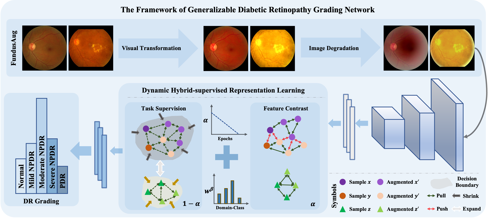

# GDRNet: Towards Generalizable Diabetic Retinopathy Grading in Unseen Domains

## Table of Contents

- [GDRNet: Towards Generalizable Diabetic Retinopathy Grading in Unseen Domains](#GDRNet-towards-generalizable-diabetic-retinopathy-grading-in-unseen-domains)
  - [Table of Contents](#table-of-contents)
  - [News](#news)
  - [Introduction](#introduction)
  - [Getting Started](#getting-started)
    - [Data Preparation](#data-preparation)
    - [Train](#train)
    - [Evaluation](#evaluation)
  - [Citation](#citation)

## News
**2023.05** Our conference paper "Towards Generalizable Diabetic Retinopathy Grading in Unseen Domains" was early accepted by MICCAI2023 with ratio of 14%.


## Introduction
Diabetic Retinopathy (DR) is a common complication of diabetes and a leading cause of blindness worldwide. Early and accurate grading of its severity is crucial for disease management. 
Although deep learning has shown great potential for automated DR grading, its real-world deployment is still challenging due to distribution shifts among source and target domains. 
<!-- The preliminary evidence presented in the paper suggests the existence of three-fold generalization issues: visual and degradation style shifts, diagnostic pattern diversity, and data imbalance.  -->
To tackle these issues, we propose a novel unified framework named Generalizable Diabetic Retinopathy Grading Network (GDRNet). 
<!-- GDRNet consists of three vital components: fundus visual-artifact augmentation (FundusAug), dynamic hybrid-supervised loss (DahLoss), and domain-class-aware re-balancing (DCR). FundusAug generates realistic augmented images via visual transformation and image degradation, while DahLoss jointly leverages pixel-level consistency and image-level semantics to capture the diverse diagnostic patterns and build generalizable feature representations. Moreover, DCR mitigates the data imbalance from a domain-class view and avoids undesired over-emphasis on rare domain-class pairs.  -->
Besides the GDRNet, we provide a publicly available benchmark, GDRBench, for fair evaluations. GDRBench contains eight datasets and unified pre-processing. You can follow [here](./GDRBench/README.md) to get this benchmark.

<p align="center">
  
</p>

## Getting Started
These instructions will help you set up the project. 

### Data Preparation

Follow the instructions [here](./GDRBench/README.md).
Your dataset should be organized as: 

```
.
├── images
│   ├── DATASET1
│   │   ├── mild_npdr
│   │   ├── moderate_npdr
│   │   ├── nodr
│   │   ├── pdr
│   │   └── severe_npdr
│   ├── DATASET2
│   │   ├── mild_npdr
│   │   ├── moderate_npdr
│   │   ├── nodr
│   │   ├── pdr
│   │   └── severe_npdr
│   ├── DATASET3
│   │    ...
│   ...  ...
│   
├── masks
│   ├── DATASET1
│   │   ├── mild_npdr
│   │   ├── moderate_npdr
│   │   ├── nodr
│   │   ├── pdr
│   │   └── severe_npdr
│   ├── DATASET2
│   │   ├── mild_npdr
│   │   ├── moderate_npdr
│   │   ├── nodr
│   │   ├── pdr
│   │   └── severe_npdr
│   ├── DATASET3
│   │    ...
│   ...  ...
│   
└── splits
    ├── DATASET1_crossval.txt
    ├── DATASET1_train.txt
    ├── DATASET2_crossval.txt
    ├── DATASET2_train.txt
    ├── DATASET3_crossval.txt
    ├── DATASET3_train.txt
    ...

```

### Train

We provide our GDRNet method and seven other methods for comparison. We also have two experiment settings, DG and ESDG.

Currently, we support other methods including:
- GDRNet
- ERM
- GREEN
- CABNet
- MixupNet
- MixStyleNet

To train the DG setting, you should indicate one dataset as target domain and others as source domains. **PLEASE NOTE** that, DDR and Eyepacs datasets will not be regarded as source domains to train. Run the following command:

```python
python main.py --root YOUR_DATASET_ROOT_PATH
               --algorithm ALGORITHM_NAME
               --dg_mode DG
               --source-domains DATASET2 DATASET3 ...
               --target-domains DATASET1 
               --output YOUR_OUTPUT_DIR
```

To train in the ESDG setting, you should indicate one dataset as source domain and others as target domains. Please run the following command:

```python
python main.py --root YOUR_DATASET_ROOT_PATH
               --algorithm ALGORITHM_NAME
               --dg_mode ESDG
               --source-domains DATASET1
               --target-domains DATASET2 DATASET3 ...
               --output YOUR_OUTPUT_DIR
```

We provide other controllable `args` in `./utils/args.py` to control the training. Besides, you can also specify the hyper-parameters for training by modifying the config files in `./configs/`.

### Evaluation

We evaluate the results during training. You can find and analyze the tensorboard results in `./YOUR_OUTPUT_DIR/`.

## Citation
```
@inproceedings{che2023DGDR,
  title={Towards generalizable diabetic retinopathy grading in unseen domains},
  author={Che, Haoxuan and Cheng, Yuhan and Jin, Haibo and Chen, Hao},
  booktitle={International Conference on Medical Image Computing and Computer-Assisted Intervention},
  pages={430--440},
  year={2023},
  organization={Springer}
}
```